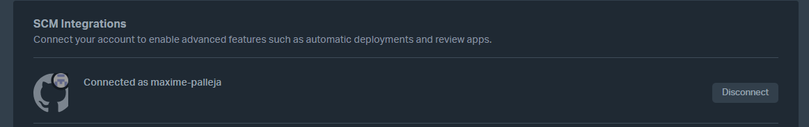
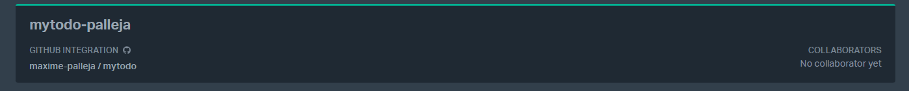
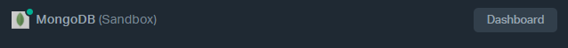
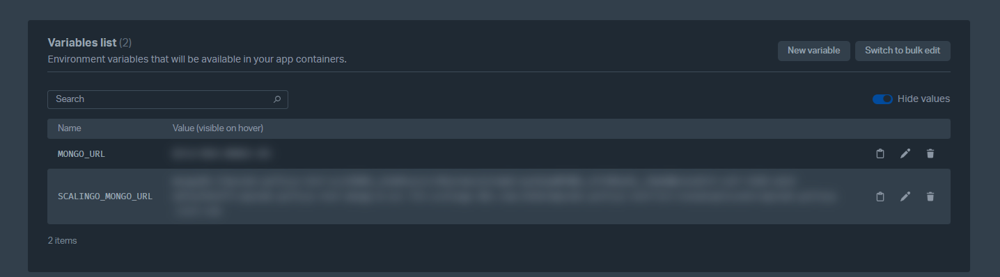
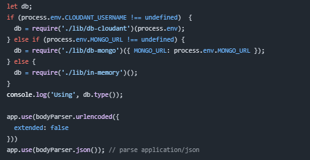
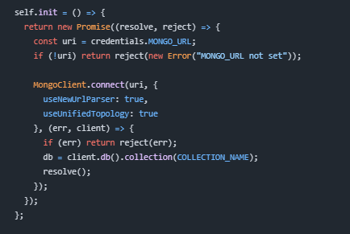
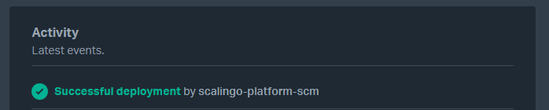

# Mon déploiement de MyTodo sur Scalingo avec MongoDB

J'ai suivi ces étapes pour déployer mon application MyTodo :

* **Fork du dépôt GitHub** :
    * J'ai commencé par faire un fork du dépôt GitHub de MyTodo sur mon compte personnel.
* **Connexion de Scalingo à GitHub** :
    * J'ai ensuite connecté mon compte Scalingo à mon compte GitHub.
    
* **Création de l'application sur Scalingo** :
    * J'ai créé une nouvelle application sur Scalingo et j'ai lié mon dépôt GitHub.
    * J'ai configuré le déploiement automatique : chaque « push » sur la branche « master » déclenche un déploiement.
    
* **Ajout d'une ressource MongoDB** :
    * J'ai ajouté une base de données MongoDB à mon application Scalingo.
    
    * Scalingo a généré la variable d'environnement `MONGO_URL` avec la chaîne de connexion.
    
* **Modification du code** :
    * J'ai modifié `server.js` pour utiliser `MONGO_URL` si elle existe.
    
    * J'ai modifié `db-mongo.js` pour utiliser `MONGO_URL` pour la connexion à MongoDB.
    
* **Déploiement continu et persistance** :
    * Chaque « push » sur « master » déploie automatiquement.
    
    * MongoDB sur Scalingo assure la persistance des données.
